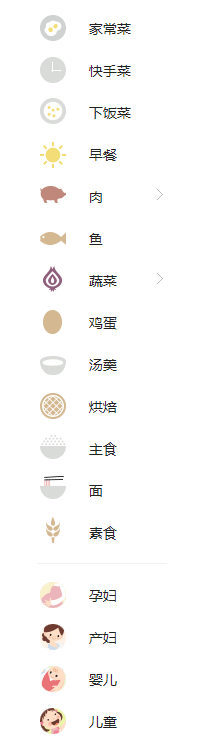

## 首页展示

1. 轮播需要展示一些特定的图片和信息, 后台可以管理.

2. 首页有一些分类,可以让用户快速进入找到自己想要逛的分类菜谱.

   

类似上图, 可以是横的nav 也可以是竖的nav.

3. 随机展示几个菜谱.

# 详情页展示

1. 移动端自适应
2. 展示菜谱简介和步骤详情
3. 展示菜谱作者

# 搜索详情页

1. 移动端自适应
2. UI和功能应足够简洁,可直接用于公众号.
3. 展示关键字相关的菜谱条目
4. 考虑使用jieba中文分词,提高搜索准确度

# 分类菜谱列表页

1. 在首页点击任一分类后,可以到达此页面

2. 此页面展示该分类下的所有菜谱,

3. 此页面具有分页功能

   ​